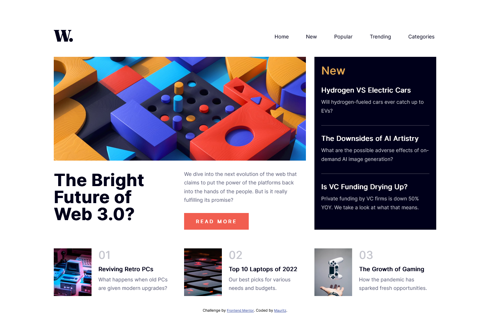

# Frontend Mentor - News homepage solution

This is a solution to the [News homepage challenge on Frontend Mentor](https://www.frontendmentor.io/challenges/news-homepage-H6SWTa1MFl). Frontend Mentor challenges help you improve your coding skills by building realistic projects. 

## Table of contents

- [Overview](#overview)
  - [The challenge](#the-challenge)
  - [Screenshot](#screenshot)
  - [Links](#links)
- [My process](#my-process)
  - [Built with](#built-with)
  - [What I learned](#what-i-learned)
  - [Continued development](#continued-development)
  - [Useful resources](#useful-resources)
- [Author](#author)

## Overview

### The challenge

Users should be able to:

- View the optimal layout for the interface depending on their device's screen size
- See hover and focus states for all interactive elements on the page
- **Bonus**: Toggle the mobile menu (requires some JavaScript)

### Screenshot




### Links

- Solution URL: [Add solution URL here](https://your-solution-url.com)
- Live Site URL: [Add live site URL here](https://mauritzlm.github.io/news-homepage/)

## My process

### Built with

- Semantic HTML5 markup
- CSS custom properties
- Flexbox
- CSS Grid
- Mobile-first workflow

### What I learned

One can use grid template areas to set up a grid.

```css
 main {
        display: grid;
        grid-template-areas:
            "picture picture new"
            "heading info new"
            "one two three";
        grid-template-columns: 1fr 1fr 1fr;
        gap: 2.5em;
    }
```
blur() removes focus from an element, this was useful because I used focus:within to display the mobile menu.

```js
closeMenuBtn.addEventListener('click', () => {
        // remove focus from button
        closeMenuBtn.blur();
    });
```


### Continued development

This challenge was really tricky. I still don't feel comfortable with css grid when building a more complex layout. I want to keep practicing with difficult layouts and learn how to structure my html and improve my css grid skills. I want to come back to this challenge and make improvements in the future.

### Useful resources

- [css tricks grid article](https://css-tricks.com/snippets/css/complete-guide-grid/) - Very helpful when working with css grid.
- [mdn blur reference](https://developer.mozilla.org/en-US/docs/Web/API/HTMLElement/blur) - blur() reference.

## Author

- Frontend Mentor - [@MauritzLM](https://www.frontendmentor.io/profile/MauritzLM)

